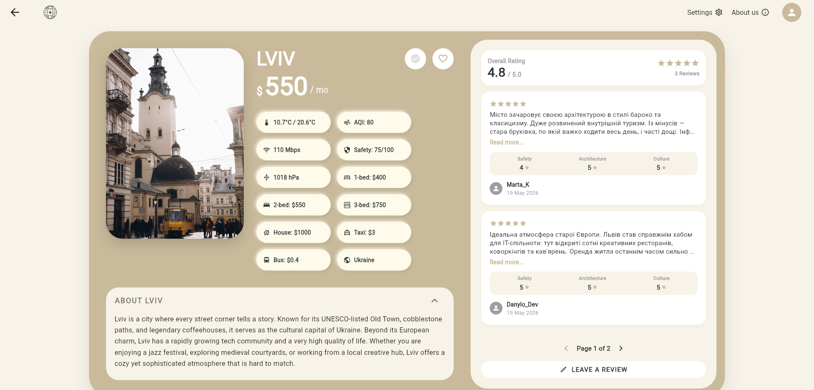
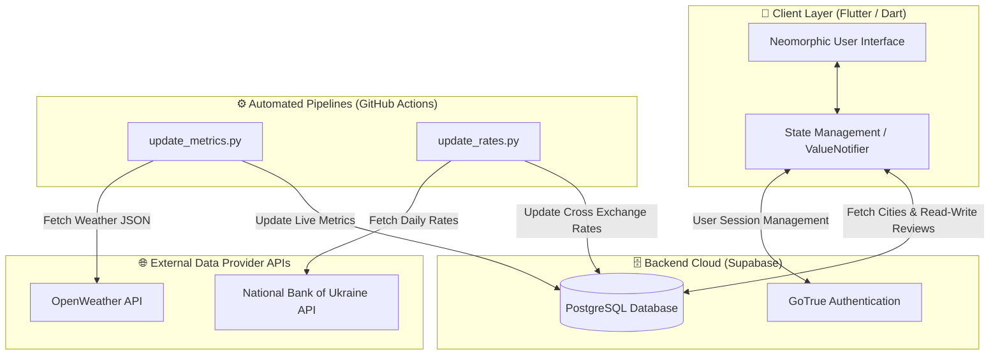

<div align="center">
  

  # 🌍 YouOptimal
  **Smart City-Ranking & Relocation Analytics Platform**

  
  
  
  
</div>

---

## 📖 About the Project
**YouOptimal** is an intelligent, cross-platform ecosystem designed for analyzing and comparing cities worldwide. Forget about keeping dozens of tabs open to research your next destination: we aggregate real-time data on climate, safety, rent costs, and real user experiences into a single, seamless neomorphic interface.

<div align="center">
  <h3>📍 Main Dashboard</h3>
  
</div>

## ✨ Key Features
* **Dynamic Currency Conversion:** Real-time exchange rate updates (UAH, EUR, USD) fetched via the National Bank of Ukraine (NBU) API and seamlessly integrated into the UI.
* **Automated Data Engineering:** CRON-triggered Python scripts run via GitHub Actions to synchronize climate metrics via OpenWeather API twice a day.
* **Interactive Analytics & Reviews:** Calculation of average city scores based on detailed, expandable user reviews (covering Safety, Architecture, and Culture).
* **Cross-Platform Consistency:** A single, responsive codebase tailored perfectly for Web, iOS, and Android platforms using advanced layout constraints.

<div align="center">
  <h3>📊 Detailed City Analytics & Reviews</h3>
  
</div>

## 🏗 System Architecture
Our platform utilizes a modern Serverless + Monorepo approach, completely isolating the reactive client UI from background automated data pipelines.



## 🚀 How to Run Locally

1. **Clone the Monorepo:**
   ```bash
   git clone [https://github.com/WTF-Write-The-Future/YouOptimal.git](https://github.com/WTF-Write-The-Future/YouOptimal.git)
   cd YouOptimal
   ```

2. **Configure Environment Variables:**
   Create a file named `env` (without extension) in the root directory and populate your Supabase configuration:
   ```env
   SUPABASE_URL=[https://your-project-id.supabase.co](https://your-project-id.supabase.co)
   SUPABASE_ANON_KEY=your-public-anon-key
   ```

3. **Launch the Application:**
   ```bash
   flutter clean
   flutter pub get
   flutter run
   ```

## 👥 The "WTF" (Write The Future) Team
* **Oleksandr Tseniuk** — Frontend Developer
* **Ostap Tutyn** — Team Lead & Backend Developer
* **Bozhena Schur** — UI/UX Designer
* **Ostap Bakhurskyi** — Full-Stack Developer
* **Vitaliy Malevych** — Backend Developer
* **Oksana Datskiv** — QA Engineer
